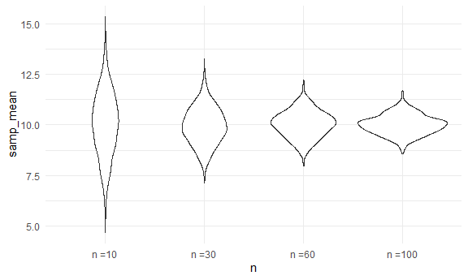

Simulation
================

``` r
library(tidyverse)
```

    ## ── Attaching core tidyverse packages ──────────────────────── tidyverse 2.0.0 ──
    ## ✔ dplyr     1.1.4     ✔ readr     2.1.5
    ## ✔ forcats   1.0.0     ✔ stringr   1.5.1
    ## ✔ ggplot2   3.5.1     ✔ tibble    3.2.1
    ## ✔ lubridate 1.9.3     ✔ tidyr     1.3.1
    ## ✔ purrr     1.0.2     
    ## ── Conflicts ────────────────────────────────────────── tidyverse_conflicts() ──
    ## ✖ dplyr::filter() masks stats::filter()
    ## ✖ dplyr::lag()    masks stats::lag()
    ## ℹ Use the conflicted package (<http://conflicted.r-lib.org/>) to force all conflicts to become errors

``` r
knitr::opts_chunk$set(
  fig.width = 6,
  fig.asp = .6,
  out.width = "90%"
)

theme_set(theme_minimal() + theme(legend.position = "bottom"))

options(
  ggplot2.continuous.colour = "viridis",
  ggplot2.continuous.fill = "viridis"
)

scale_colour_discrete = scale_colour_viridis_d
scale_fill_discrete = scale_fill_viridis_d
```

Load key packages

``` r
library(tidyverse)
library(readxl)
library(rvest)
```

    ## 
    ## Attaching package: 'rvest'

    ## The following object is masked from 'package:readr':
    ## 
    ##     guess_encoding

``` r
set.seed(1031) #setting the seed makes sure you get the same random numbers everytime you run the simulation
```

## writing a simulation function

``` r
sim_mean_sd = function(samp_size, true_mean = 10, true_sd = 5) {

    sim_df = 
    tibble(
      x = rnorm(samp_size, true_mean, true_sd)
    )
  
  out_df = 
    sim_df |> 
    summarize(
      samp_mean = mean(x),
      samp_sd = sd(x)
    )
  
  return(out_df)
}

sim_mean_sd(samp_size = 30, true_mean = 4, true_sd = 12)
```

    ## # A tibble: 1 × 2
    ##   samp_mean samp_sd
    ##       <dbl>   <dbl>
    ## 1      4.33    11.4

run this a lot of times …

``` r
sim_mean_sd(30)
```

    ## # A tibble: 1 × 2
    ##   samp_mean samp_sd
    ##       <dbl>   <dbl>
    ## 1      7.38    4.68

run this using a for loop?

``` r
output = vector("list", 1000)

for (i in 1:1000) {
  
  output[[i]] = sim_mean_sd(30)
  
} #once run, now you've ran this 1000 times and generated 1000 sd

#output

bind_rows(output) |> 
  summarize(
    ave_samp_mean = mean(samp_mean),
    SE_samp_mean = sd(samp_mean)) #can check 5 / sqrt(30) to check if sd_mean is similar  
```

    ## # A tibble: 1 × 2
    ##   ave_samp_mean SE_samp_mean
    ##           <dbl>        <dbl>
    ## 1          9.94        0.920

Can I use map instead

``` r
#create df to hold all simluation results
sim_res = 
  tibble(
    iter = 1:1000
  ) |> 
  mutate(samp_res = map(iter, sim_mean_sd, samp_size = 30)) |> 
  unnest(samp_res)
```

Could I try different sample sizes?

``` r
sim_res =
  expand_grid( #creates all possible outcomes of n=10,30,etc with 1000 iterations
    n = c(10, 30, 60, 100),
    iter = 1:1000
  ) |> 
  mutate(samp_res = map(n, sim_mean_sd)) |>  #add a column to record results you are iterating with a changing input 'n', so get sim_mean_sd for n=10, then sim_mean_sd for n=30, etc
  unnest(samp_res)
```

``` r
sim_res |> 
  group_by(n) |> 
  summarize(
    se = sd(samp_mean)
  )
```

    ## # A tibble: 4 × 2
    ##       n    se
    ##   <dbl> <dbl>
    ## 1    10 1.61 
    ## 2    30 0.927
    ## 3    60 0.664
    ## 4   100 0.491

``` r
sim_res |> 
  mutate(
    n = str_c("n =", n), #made it into chr variable to separate columns
    n = fct_inorder(n)) |> 
#  filter(n == 10) |> 
  ggplot(aes(x = n, y = samp_mean)) +
  geom_violin()
```



### Simple Linear Regression

See what estimated slope and intercepts are and compare to true slope
and intercept

``` r
sim_data = 
  tibble(
    x = rnorm(30, mean = 1, sd = 1),
    y = 2 + 3 * x + rnorm(30, 0, 1)
  )

lm_fit = lm(y ~ x, data = sim_data) #linear model fit, x and intercept changes every time you run

sim_data |> 
  ggplot(aes(x = x, y =y)) +
  geom_point() +
  stat_smooth(method = "lm") #every time you run this, slope, intercept changes
```

    ## `geom_smooth()` using formula = 'y ~ x'


Running the iteration multiple times allows us to determine confidence
interval

Turn this into a function

``` r
sim_regression = function(n) {
  
  sim_data = 
    tibble(
      x = rnorm(n, mean = 1, sd = 1),
      y = 2 + 3 * x + rnorm(n, 0, 1)
    )

  lm_fit = lm(y ~ x, data = sim_data)
 
  out_df =
    tibble(
      beta0_hat = coef(lm_fit)[1], #estimated coeff
      beta1_hat = coef(lm_fit)[2] #estimated slope
    )
   
  return(out_df)
}


sim_res = 
  expand_grid(
    sample_size = c(30,60),
    iter = 1:1000
  ) |>  #creates 1000 iterations, sample size 30 each time, then size 60
  mutate(lm_res = map(sample_size, sim_regression)) |>  #adding a column
  unnest(lm_res)

sim_res |> 
  mutate(sample_size = str_c("n = ", sample_size)) |> 
  ggplot(aes(x = sample_size, y = beta1_hat)) +
  geom_boxplot()
```


``` r
sim_res |> 
  filter(sample_size == 30) |> 
  #checking are the estimates of beta0 and beta1 related to each other?
  ggplot(aes(x = beta0_hat, y = beta1_hat)) +
  geom_point() 
```


``` r
  #resulting plot is inverse relationship -> higher the y-intercept, smaller slope
```
